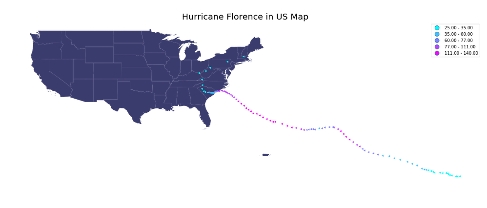

# Use geospatial data to plot the path of Hurricane Florence from August 30th to September 18th. 

The legend on notebook does not appear correctly. The correct output should be the following image. The numbers is the legend are miles per hour! 

